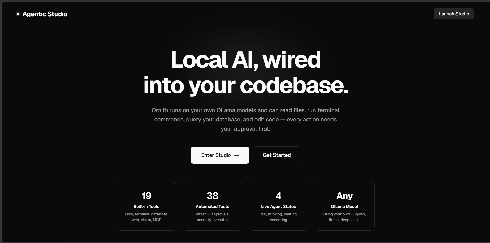
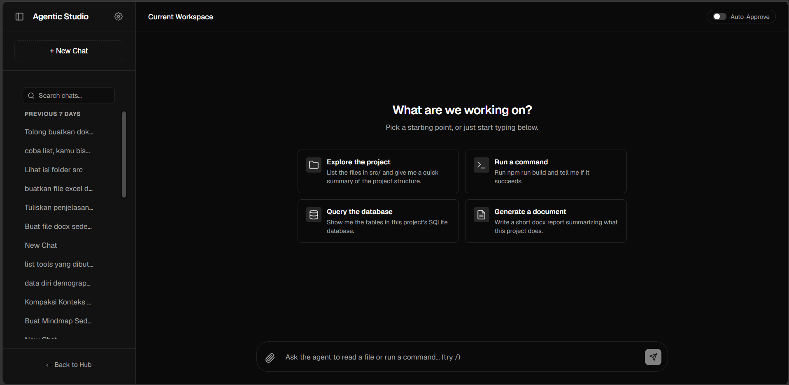
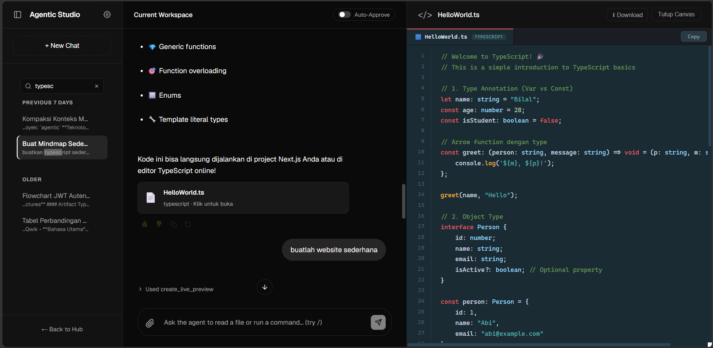

# Agentic Studio

[](./LICENSE)
[](https://nextjs.org)
[](https://nodejs.org)
[](#local-data--privacy)

A privacy-first, extensible AI coding agent that runs entirely on your own machine. Agentic Studio connects a local LLM (via [Ollama](https://ollama.com)) to your codebase, your terminal, your databases, and your documents — with every potentially dangerous action gated behind an explicit human approval, and nothing ever leaving your laptop.

Built for indie developers who want a Cursor/Claude Code–style workflow without sending their code or their data to the cloud.

## Screenshots

| Landing page | New chat | Multi-mode canvas |
| :---: | :---: | :---: |
| [](preview/hub.png) | [](preview/main.png) | [](preview/preview.png) |
| Local stats pulled straight from the codebase (tool count, test count, live states) | Quick-start prompts for exploring the project, running commands, querying the database, or generating documents | The code editor canvas open beside the chat, rendered instead of a raw code block |

## What it can do

- **Codebase-aware chat** — read files, list directories, and grep across your project so the agent can answer questions and make changes with real context.
- **Safe file edits & terminal access** — `write_local_file`, `edit_local_file`, and `run_terminal_command` all pause for your explicit approval before running anything, via a single-use, tamper-checked approval token.
- **Database introspection** — connect to a local SQLite file or a Postgres database and let the agent read the schema before writing queries.
- **Real document generation** — ask for an actual `.docx`, `.xlsx`, or `.pptx` file and get one saved to `workspace/output/`, downloadable straight from the chat.
- **A multi-mode canvas** — code editor, live HTML preview, rich-text documents, Mermaid diagrams, interactive spreadsheets, and charts, all rendered in a side panel instead of dumped as raw text in the chat.
- **MCP support** — connect any [Model Context Protocol](https://modelcontextprotocol.io) server from Settings and its tools become available to the agent immediately (always approval-gated, since a third-party tool's behavior can't be known in advance).
- **Vision** — attach images and a local vision sub-model describes them for the main model to reason about.

## Requirements

- [Node.js](https://nodejs.org) 20 or newer
- [Ollama](https://ollama.com) installed and running locally
- Two Ollama models pulled (or created) locally:
  - a main chat/tool-calling model (default tag: `ornith:9b`)
  - a smaller helper model used for vision descriptions and conversation-summarization (default tag: `qwen3.5:4b`)

  These default names are whatever models you've set up locally — if you're pulling stock models from the Ollama registry instead, pull something with solid tool-calling support (e.g. `ollama pull qwen2.5:7b`) and point Settings at it; see "Configuration" below.

## Getting started

```bash
npm install
npm run dev
```

Then open [http://localhost:3000](http://localhost:3000) and click **Enter Studio**.

On first launch, open **Settings** in the Studio UI and confirm:

- **Workspace root** — the local folder the agent's file/terminal/database tools operate inside. Defaults to this app's own folder; point it at whatever project you want the agent to work on.
- **Chat model / Sub-agent model** — the Ollama model tags to use (see Requirements above).
- **Ollama URL** — defaults to `http://127.0.0.1:11434`; change it if Ollama runs elsewhere.
- **MCP servers** — optionally add external MCP servers (stdio-launched, e.g. `npx -y @modelcontextprotocol/server-filesystem <path>`) to extend the agent's tools.

If Ollama isn't running or the configured model isn't pulled, the chat will surface a clear error rather than hanging silently.

## Local data & privacy

Everything the app stores lives on your machine, next to the project, and is git-ignored:

- `.agentic-chats.db` — chat history (SQLite)
- `.agentic-settings.json` — your workspace path, model choices, and any configured MCP servers (which may include API keys/tokens for third-party MCP servers)
- `.agentic-memory.json` — preferences you've asked the agent to remember
- `workspace/output/` — generated `.docx` / `.xlsx` / `.pptx` files

Nothing here calls out to a cloud AI provider — inference happens through your local Ollama instance.

## Development

```bash
npm run lint   # ESLint
npm test       # Vitest — unit tests for the security-critical modules (approval tokens, the
               # path-traversal guard, origin checking) and the chat storage layer
```

## Known issues

- **`image-size` (a dependency of `pptxgenjs`) has two open, unpatched denial-of-service advisories** ([GHSA-w3rx-r6r6-pgpr](https://github.com/advisories/GHSA-w3rx-r6r6-pgpr), [GHSA-5p2g-fcmc-qvqq](https://github.com/advisories/GHSA-5p2g-fcmc-qvqq)) affecting its ICNS/JXL/HEIF parsers — a specially crafted image can hang the process in an infinite loop. No patched release exists upstream as of this writing (checked directly against the advisories, not just `npm audit`'s summary — every published version, including the latest, is listed as affected). `npm audit fix --force`'s suggested fix (downgrading `pptxgenjs` to `1.1.5`) is not a real fix and is not applied here.
  Accepted as a known risk, for two independently-confirmed reasons: (1) `generate_presentation` in this codebase never calls `pptxgenjs`'s image-embedding API, and (2) inspecting `pptxgenjs`'s own installed bundle (`node_modules/pptxgenjs/dist/pptxgen.cjs.js`) shows `image-size` is dead weight there too — the only reference to it is inside a comment block explicitly marked `FIXME: TODO: currently unused`; the only dependency `pptxgenjs` actually `require()`s at runtime is `jszip`. So the vulnerable parsers aren't reachable through any path in this app, nor through `pptxgenjs` itself as currently published. (We also confirmed there's no clean way to silence this in `npm audit`'s report: the advisories have no version floor, so even a decade-old `image-size` release without ICNS/JXL/HEIF support at all still gets flagged. The only way to make the audit report 0 here would be aliasing `image-size` to an empty stub package via npm `overrides` — deliberately decided against, since a naive stand-in package can introduce its own vulnerabilities, as tested, and a proper zero-dependency stub adds fragility if `pptxgenjs` ever starts really using it.)
  Re-evaluate if image embedding is ever added to `generate_presentation`, or periodically check `npm audit` for an upstream fix.
- `xlsx` is pinned to a tarball from the SheetJS CDN (`https://cdn.sheetjs.com/...`) rather than the npm registry, because the npm-published `xlsx` package has been stuck on an old, vulnerable version (0.18.5) for a long time — see [SheetJS's own installation docs](https://docs.sheetjs.com/docs/getting-started/installation/nodejs/). This is SheetJS's own documented recommendation, not a workaround.

## Project structure

```
src/app/
  page.tsx                     Landing page
  studio/page.tsx               Main chat + canvas UI
  api/agent/route.ts            Orchestration loop (streams to/from Ollama, runs tools)
  api/agent/tools/               Tool implementations, settings, approvals, MCP client, chat storage
  api/agent/tools/execute/       Endpoint that runs an approved dangerous tool call
  api/chats/                     Chat list CRUD
  api/download/                  Serves generated files from workspace/output/
  api/settings/                  Reads/writes app settings
```

## License

MIT — see [LICENSE](./LICENSE).
